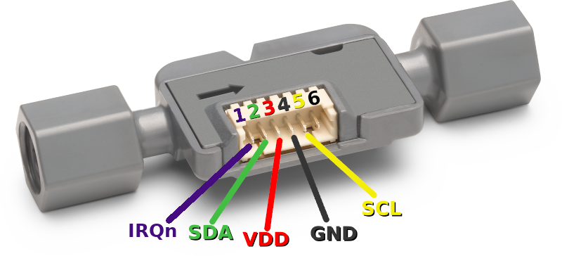
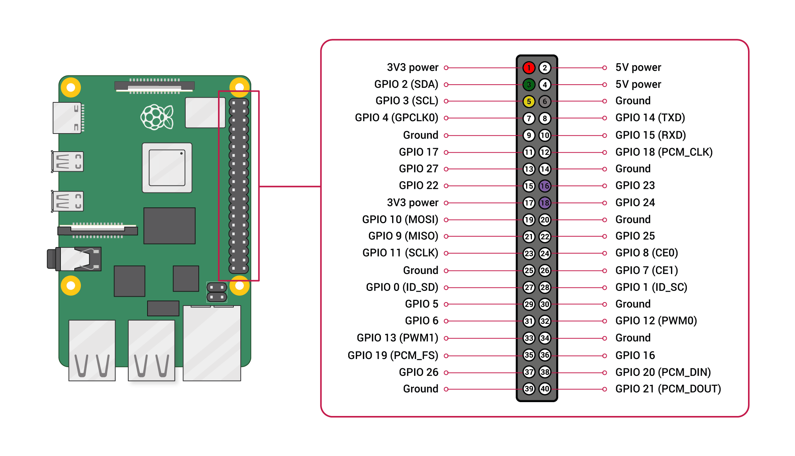
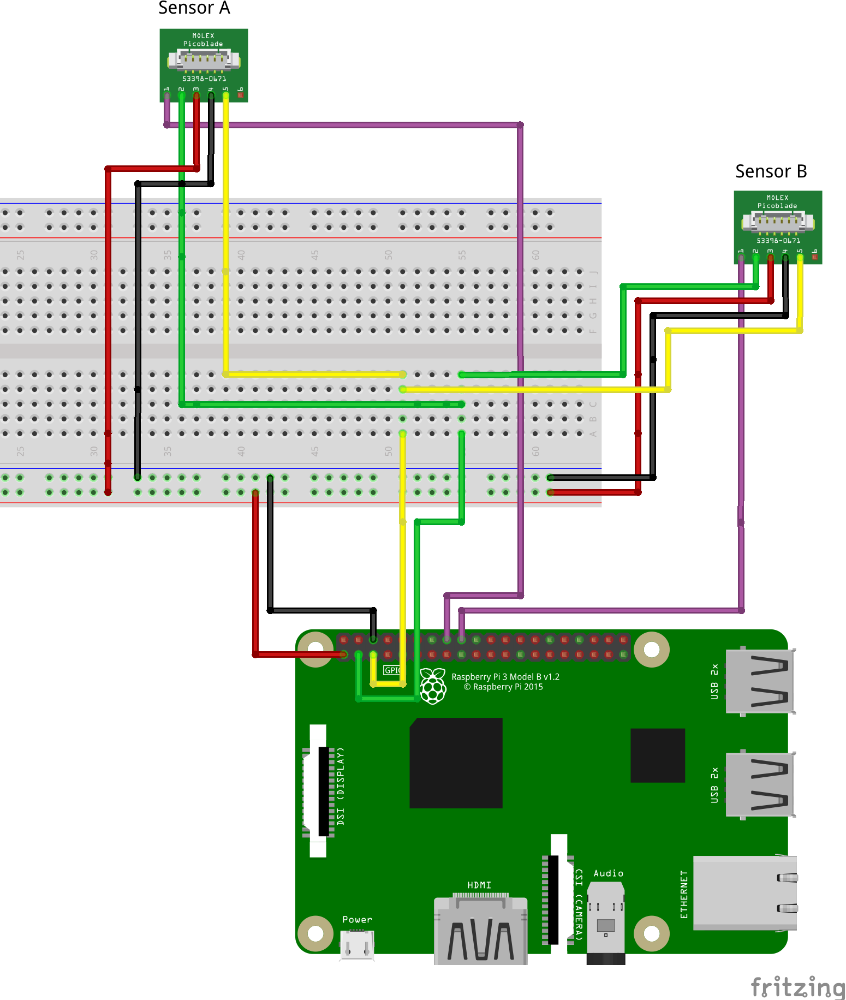

# How to change I²C Address for SLF3x Sensor

In a setup where you want to attach more than one SLF3x Sensor to the same I²C Bus you have two options. You can use a multiplexer or you change the I²C address of the attached sensors.

 This example explains how you can change the I²C address of your SLF3x sensor and subsequently reading out measurements from both sensors. Note that the address change is not permanent, meaning that the sensor is set back to its default address after a soft reset (specific I2C command) or hard reset (power cycle).

## Setup instructions

The example is set up with a Raspberry-Pi and two SLF1300-F sensors attached.

### Sensor wiring

Connect both sensor the your Raspberry-Pi following the table below. 



| *SLF3x* | *SLF3x Pin* | *Cable Color* | *Raspberry-Pi Pin* |  *Comments* |
| :---: | --- | --- | --- | --- |
| IRQn| 1 | purple | Pin 16 / Pin 18 | Connect IRQn pin of each sensor to its own GPIO pin on the board
| SDA | 2 | green | Pin 3 | Connect SDA pins of all sensors to Pin 3 of the Raspberry Pi
| VDD | 3 | red | Pin 1 |
| GND | 4 | black | Pin 6 |
| SCL | 5 | yellow | Pin 5 | Connect SCL pins of all sensors to Pin 5 of the Raspberry-Pi



To be able to connect the SDA, SCL, VDD and GND of both
sensors to the same pin on the Raspberry-Pi, you can for example use a Breadboard and wire the sensors as shown below.




### Install driver for SLF3x

Follow the `Quick start example` you find in the main README of this repository.

### Install pigpio library on Raspberry-Pi

To access the GPIO Pins on your Raspberry-Pi form C Code we use the pigpio library.
To install, open a [terminal](https://projects.raspberrypi.org/en/projects/raspberry-pi-using/8) 
on your Raspberry-Pi and follow these instructions:

```
wget https://github.com/joan2937/pigpio/archive/refs/tags/v79.zip
unzip v79.zip
cd pigpio-79
make
sudo make install
```

### Compile and run address change example

- Compile the example
    1. Navigate to the example directory. E.g. `cd ~/raspberry-pi-i2c-sf06_lf/example-i2c-address-change`
    2. Make sure the GPIO Pin definitions and the new I2C addresses correct
       * Open `slf3x_example_i2c_address_change.c`
       * Check the GPIO Pin definitions
            ```
            #define IRQN_PIN_SENSOR_A 4
            #define IRQN_PIN_SENSOR_B 2
            ```
       * Check the new I2C addresses to use. You can use any I2C address in the range of 0x0 to 0x7F
            ```
            #define I2C_ADDR_SENSOR_A 0x0A
            #define I2C_ADDR_SENSOR_B 0x0B 
            ```
    3. Run the `make` command to compile the example

- To test the address change and reading out measurement values from both sensors attached
    - Run `./slf3x_example_i2c_address_change` in the same directory you used to compile.
    - You should see a message that the sensor address changed and the measurement values in the console.

<details><summary>Detaild Address Change Sequence</summary>
<p>

1. Send I2C Address change command to default sensor address 0x08. This command is recieved by all SLF3x sensors on the bus still having the default address.
2. Select the sensor which should accept the new I2C address sent in step 1 by sending a high pulse of at least 150μs to its IRQn Pin.
   * To do so, set the GPIO Pin of the board where the IRQn Pin of the sensor is connected to output mode and set it to a high state for at least 150μs.
   * The sensor waits for such a pulse on the IRQn Pin for 1.5ms after the I2C address change command has been sent.
3. Change the GPIO Pin back to low state and switch it to INPUT mode. You might want to configure it with a pulldown to avoid unintended high state.
4. Wait until 1.5ms have elapsed after sending the I2C address change command.
5. Read out the GPIO Pin, which should be set to high state for 200μs if the sensor changed its I2C address successfully.

</p>
</details>


## Limitations

- The feature is only supported by SLF3x sensors with a serial number above 23xxxxxxxx.
- After a soft reset (specific I2C command) or hard reset (power cycle) the I²C address is set back to the default address 0x08.

## Further readings

[Application note SLF3x I2C Address change](https://www.sensirion.com/media/documents/15D8B73E/6614FAE3/LQ_AN_SLF3x-I2C-Address-change.pdf)

